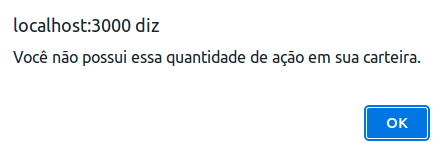
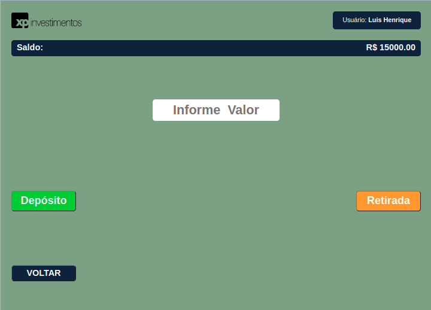
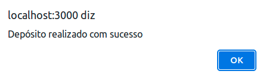
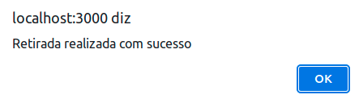

# Projeto desafio XPInc

**Este projeto foi feito exclusivamente para o processo seletivo da XPInc**

## Figma do projeto


## Tecnologias utilizadas 

* **HTML**
* **CSS**
* **JavaScript**
* **React**

## Habilidades Trabalhadas no Projeto

* **Utilizar a Context API do React para gerenciar estado.**
* **Utilizar o React Hook useState;**
* **Utilizar o React Hook useContext;**
* **Utilizar o React Hook useEffect;**

## Ferramentas utilizadas

* **Git e github** - para versionamento de código
* **Heroku** - para deploy da aplicação
* **Figma** - para produzir os templates
* **VsCode** - para codificar 

## Para a execução do Projeto

#### Clone o projeto para sua máquina
  * ```git clone git@github.com:senseyluiz/desafioXPInc.git```


#### Instale as dependencias 
  * ```npm install```

#### Execute a aplicação
  * ```npm start```

## Observação  para utilizar a aplicação

### Foi criado dois usuarios para teste

*  **Usuario 1**

    * **email:** senseyluiz@gmail.com
    * **senha:** luis1234

*  **Usuario 2**

    * **email:** usuarioteste@gmail.com
    * **senha:** teste1234

**Cada usuário possui:**
  * Nome
  * Email
  * Password
  * Saldo
  * Carteira de ações

### Nessa aplicação possui somente 10 ATIVOS(Ações) para teste

**Cada Ativo possui:**
  * Nome
  * Valor
  * Quantidade

  ****

# Sobre o Projeto

### Tela de login


**Nessa tela é solicitado email e senha do usuário:**

* Caso email seja no formato incorreto será devolvido uma mensagem: ***"Você deve digitar um email válido"***

* Caso password tenha menos de 8 caracters será devolvido uma mensagem: ***"Você deve fornecer uma senha válida acima de 7 caracteres"***


* Caso email e senha esteja nos frmatos corretos, será verificado se existe um usuário com este email e senha. 
    * Se não existir, será retornado a mensagem: ***Usuário ou senha inválida***

    * Se existir, o usuário será redirecionado para a página de lista de ações


****

### Tela de lista de ações


**Nessa tela, aparece o nome do usuário que foi conectado e sua carteira de ações. Aparece também as ações que ele ainda nã possui em carteira.**

**Ao lado dos dados de cada ação, existe dois botões(C e V) para negociar a ação. Nas ações disponiveis que o usuário ainda não possui em carteira, o botão de vemda não está ativo. Ao clicar em um dos botões, o usuário é direcionado para a página em que ele possa negociar o ativo.**

**No final da tela possui um botão ```"Depósito/Retirada"``` que direciona o usuário para a tela onde o usuário possa fazer tais operações de depósito ou retirada**

****

## Tela de Compra e Venda de Ações


**Nessa tela, o usuário pode negociar a ação específica.**
**Na tela possui o nome do usuário, o saldo, e os dados da ação que ele deseja negociar.**

**Basta o usuário digitar a quantidade de ações que ele deseja. A ação possui um valor unitário, e ao escolher a quantidade a ser negociado, o campo com valor total é resolvido automaticamente.**
**Tendo escolhido a quantidade e sabendo o valor total a ser pago, o usuário só precisa escolher se vende ou compra**

* Se o usuário deseja comprar:
  * Será verificado se o saldo existente em conta é igual ou superior ao valor a ser pago
    * Caso o saldo seja superior, o total a ser pago será subtraido do valor do saldo e a compra é realizada, retornando uma mensagem "Compra realizada com sucesso"

    


    * Caso o saldo seja inferior, será devolvido uma mensagen: "Saldo Insuficiente" e será impedido de realizar a compra.
    


* Se u usuário deseja vender:
  * Será verificado se possui esse ativo em sua carteira e se a quantidade é maior ou igual a quantidade que deseja vender.
    *  Caso o usuário possua no mínimo a quantidade a ser vendida, a venda será realizada com sucesso e adicionado o valor em seu saldo. Retorna a mensagem "Venda realizada com Sucesso"

    

  * Caso o usuário não possua a quantidade de ativos em sua carteira será retornado a mensagem:


  


  **No final da tela possui um botão ```"Depósito/Retirada"``` que direciona o usuário para a tela onde o usuário possa fazer tais operações de depósito ou retirada**

  ****

## Tela de Deósito e Retirada

  

  **Nessa tela o usuário pode efetuar depósito e retirada de seu saldo.**
  O Usuário digita o valor que deseja e clique em um dos botões:

  * **Depósito:**
    * Será adicionado em seu saldo o valor desejado em seu saldo e retornando a mensagem:

     

  * **Retirada**
    * Será verificado se o usuário possui saldo igual ou superior ao valor desejado para retirada.
      * Caso possua esse valor, será subtraido de seu saldo o valor e retornado a mensagem:

      

      * Caso não possua esse valor, será impedido de efetuar a retirada e retorna a mensagem:

      

  ****

  ## Tela de Erro

  

  **Caso o usuário tente acessar uma rota que não existe, essa será a página de retorno**
  **Essa página além da mensagem, existe um link que redireciona o usuário para a página de login**

  ****

  ## Link da Aplicação para teste

  ### https://desafioxpinc.netlify.app/

  ## Dados de contato do desenvolvedor

  ### Nome: Luis Henrique

  ### Linkedin: https://www.linkedin.com/in/luishrocha
  ### Github: https://github.com/senseyluiz
  ### Email: senseyluiz@gmail.com

  